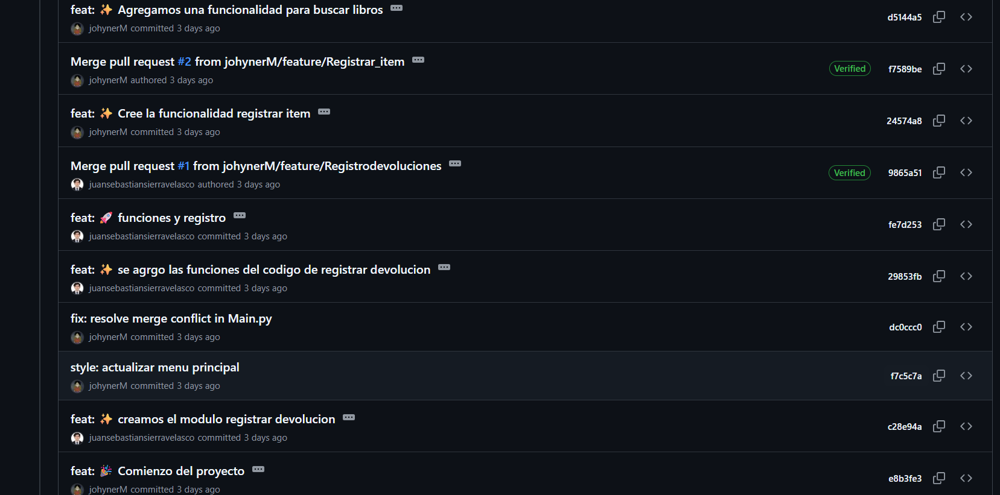
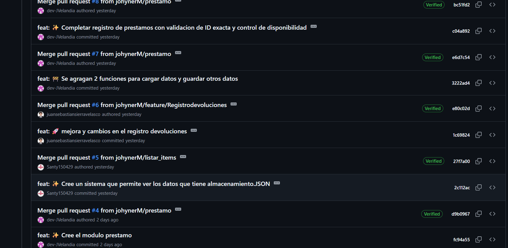
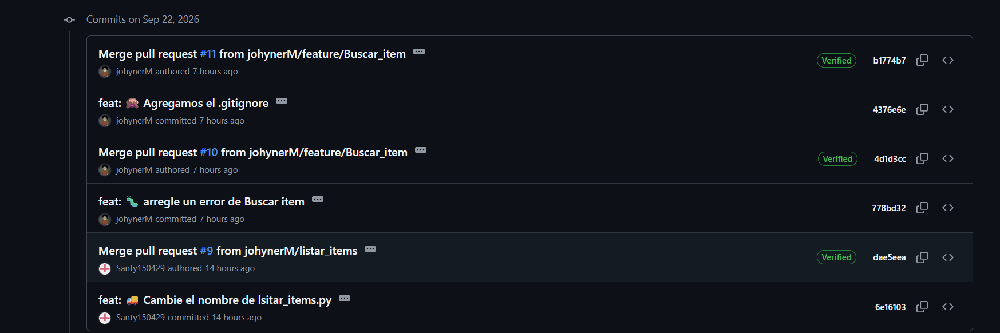
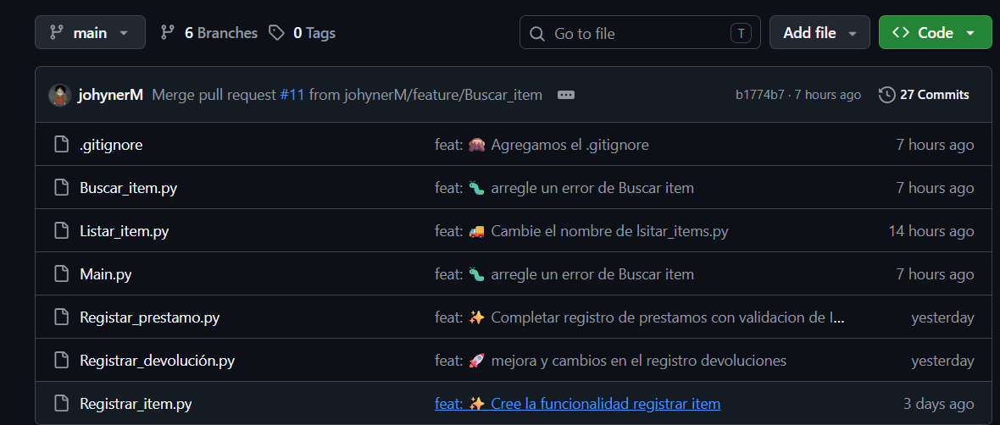
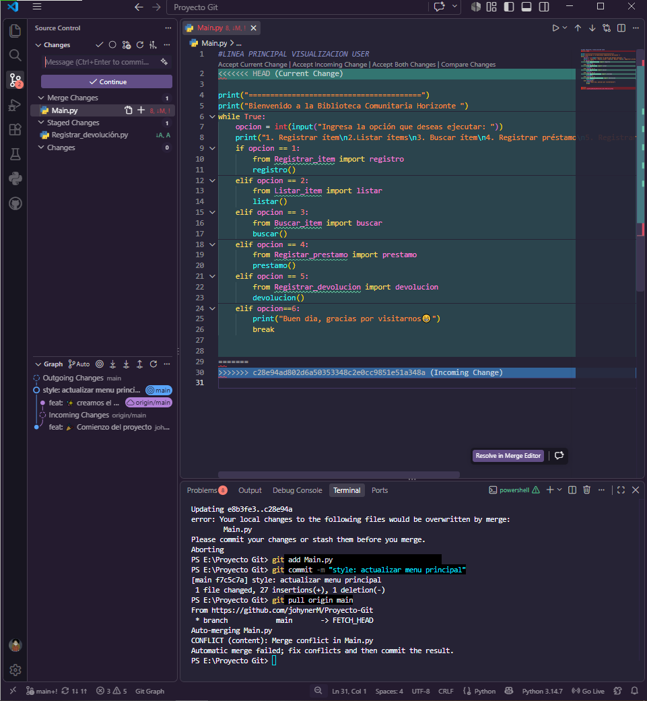
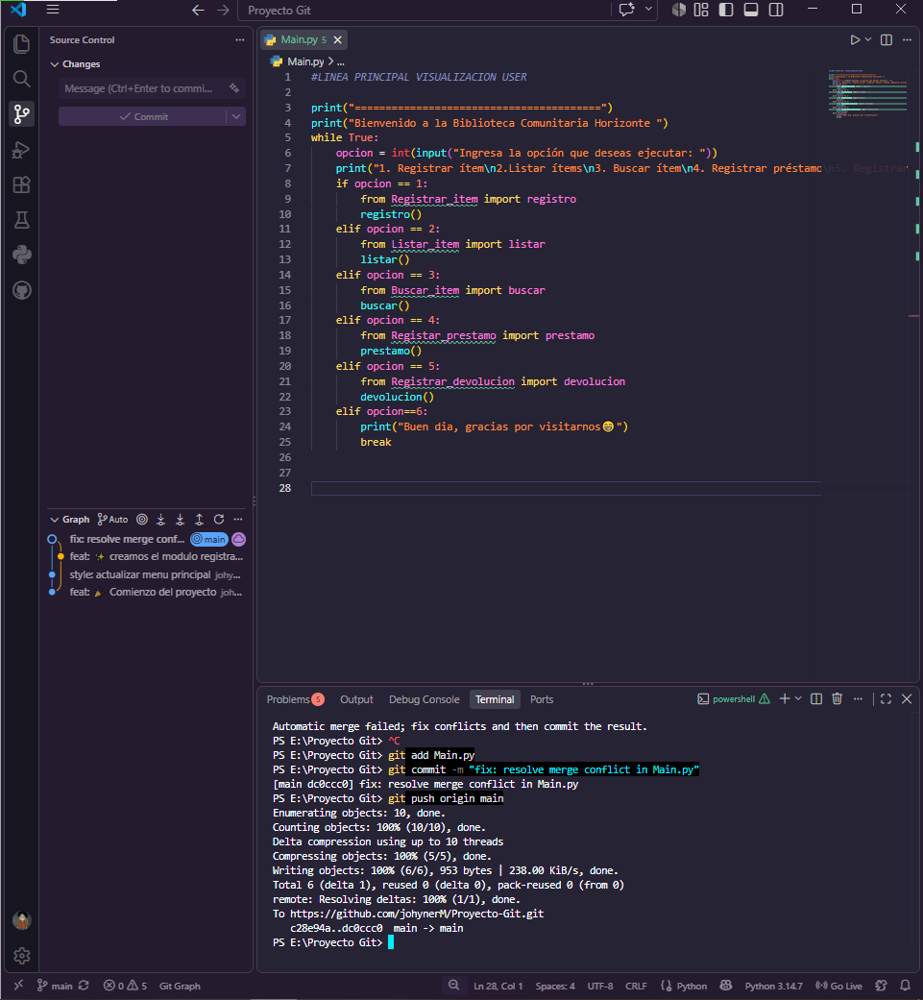

# Proyecto Git
## PAGINA PARA BIBLIOSTOCK

Este proyecto realiza varias funcionalidades aplicadas para el uso de una biblioteca llamada Bibliostock, con esto pueden gestionar su inventario, realizar busquedas avanzadas de los productos, mantener un control para el prestamo y la devolucion de los mismos, todo esto ubicadp en un archivo JSON para mantener su registro.

## CONTENIDO
- [Funcionalidades](#-características)
- [Estructura del Proyecto](#-estructura-del-proyecto)
- [Instalación y Uso](#-instalación-y-uso)
- [Flujo de Trabajo](#-flujo-de-trabajo-git-workflow)
- [Solución de Problemas ](#-solución-de-problemas)
- [Participantes del Proyecto](#-contribuyentes)
## Funcionalidades
- **Módulo principal Main.py:**          
Este módulo es donde se maneja el redireccionamiento de lo que desea realizar en usuario cuando entre al sistema, esto lo hacemos mediante el from de cada archivo y llamando un funcion que ejecute ese archivo usando el import, se le mostrará las opciones que tiene disponibles y cuando elija escribiendo el número de la opcion deseada en este módulo se redireccionara esa información para llegar a los demas módulos respectivamente.

- **Módulo Registrar_item.py:** 

Tenemos las funciones cargar_datos(),guardar_datos() y registro(). cargar_datos() funciona para revisar si ya existe o no el archivo inventario.json usando un try-except. La funcion guardar_datos() sobre escribe el archivo inventario.json con la nueva informacion que se registrará. Finalmente, la función registro() pide la informacion necesaria para guardar de forma correcta un nuevo libro (datos como titulo, ID, ubicación, categoria, autor y cantidad) y la agrega al archivo inventario.json 

- **Módulo Buscar_item.py:** 

Aqui tenemos las funciones cargar_datos() y buscar(). Con la función cargar datos hacemos lo mismo que en registar_item leemos el archivo inventario.json si existe y si no mostramos un mensaje de error. La función buscar() muestra un mini menú para observar opciones de busqueda y busca los datos ingresados por el usuario y los compara con los datos en inventario.json si son iguales los mostrara en pantalla sino sera un mensaje de error.

- **Modulo para registrar los prestamos:**
1. Variables Globales 
Definen los nombres de los archivos que actuarán como la base de datos persistente del sistema.

2. Función cargar_datos(ruta)Se encarga de leer el contenido de cualquier archivo JSON especificado.Manejo de Errores con try-except:Captura FileNotFoundError (si el archivo no existe aún).Captura json.JSONDecodeError (si el archivo está vacío o tiene formato JSON inválido).Retorno seguro: Si ocurre alguno de los errores mencionados, retorna una lista vacía [] en lugar de detener el programa.

3. Función guardar_datos(ruta, datos)Escribe o sobrescribe una estructura de datos (listas/diccionarios) dentro del archivo JSON indicado en ruta.Parámetros clave:indent=4: Aplica sangría al archivo JSON para que sea fácil de leer por humanos.ensure_ascii=False: Permite guardar caracteres especiales como tildes o la letra ñ sin alterarlos.

4. Función prestamo() (Flujo Principal)Esta función coordina todo el proceso de préstamos siguiendo una lógica de validaciones paso a paso:Carga Inicial: Carga los datos actuales del inventario y los préstamos previos.Validación de Inventario Vacío: Verifica si la lista inventario tiene elementos. Si no hay libros registrados, detiene la ejecución.Búsqueda por ID Exacto:Solicita al usuario el ID e ignora espacios accidentales en los extremos usando .strip().Recorre la lista buscando coincidencia exacta con la clave "ID".Validación de Existencia y Stock:Si no se encuentra el libro, lanza un mensaje de error y finaliza.Si el libro existe pero "Cantidad" es $0$ o menor, notifica que no hay ejemplares disponibles y finaliza.Captura y Validación de Datos del Usuario:Toma el título directamente del inventario (evita que el usuario cometa errores tipográficos al escribir el título).Pide el nombre del usuario y la fecha. Si alguno de los dos campos queda vacío, detiene el proceso.Actualización e Guardado:Crea un diccionario Nuevo_prestamo y lo agrega a la lista prestamos.Resta 1 al stock del libro en la variable inventario (libro_encontrado["Cantidad"] -= 1).Llama a guardar_datos() para actualizar tanto el archivo prestamos.json como inventario.json.

- **El módulo de devoluciones:**

permite registrar la devolución de uno o varios productos al inventario. Para su funcionamiento, utiliza las funciones cargar_datos () y guardar_datos (), provenientes del módulo Registrar_item, las cuales permiten cargar la información existente y guardar los cambios realizados.

Para iniciar el programa, se define una función llamada devoluciones (). Dentro de esta función se cargan los datos y se solicita al usuario el ID del producto que desea devolver. 

Luego, el programa busca la ID ingresada dentro de los productos registrados. Cuando encuentra el producto correspondiente, muestra su título y solicita la cantidad de productos que se desea devolver.

Si la cantidad ingresada es mayor que cero, esta cantidad se suma a la cantidad existente del producto en el inventario. Después, se guardan los datos actualizados mediante guardar_datos () y se muestra un mensaje indicando que la devolución fue realizada correctamente.

Si, por el contrario, el usuario ingresa una cantidad igual o menor que cero, el programa muestra un mensaje indicando que la cantidad debe ser mayor que cero.

Finalmente, el else que se encuentra después del for indica que, si después de recorrer todos los productos no coincide la ID ingresada por el usuario con ninguna de las registradas, se muestra el mensaje Producto no encontrado.

Funcionalidades

•	Carga los productos registrados.

•	Solicita el ID del producto.

•	Busca el producto en el 

inventario.

•	Solicita la cantidad a devolver.

•	Actualiza la cantidad disponible.

•	Guarda los cambios realizados.

•	Valida que el producto exista y que la cantidad sea mayor que cero.

- **Modulo para listar los items:**
 
 Función cargar_datos()
Se encarga de recuperar los datos persistentes del inventario.

Uso de try-except:

FileNotFoundError: Si inventario.json aún no existe, captura la excepción sin interrumpir el programa.

json.JSONDecodeError: Si el archivo existe pero está vacío o mal escrito (JSON inválido), también evita el colapso del sistema.

Retorno seguro: En caso de fallar o no encontrar datos, devuelve una lista vacía []. En caso de éxito, retorna la lista de diccionarios que representa el inventario.

 **Función listar() (Flujo Principal de Visualización)**
Esta función procesa y muestra la información en consola siguiendo este flujo:

Obtención de Datos: Llama a cargar_datos() para cargar el contenido actualizado del inventario.

Validación de Inventario Vacío:

Evalúa if not inventario:. Si la lista está vacía, imprime un mensaje notificando que no hay ítems registrados e interrumpe la función con return.

**Impresión Formateada:**

Utiliza un bucle for para iterar sobre cada item (un diccionario con la información del libro).

Hace uso intensivo del método .get('clave', 'valor_por_defecto'). Esto previene errores de tipo KeyError si a un libro le falta alguna propiedad en el archivo JSON.

Valores de respaldo: Si alguna clave no existe en un registro, asigna 'N/A' (o 0 para el campo "Cantidad").


## Estructura del Proyecto
```text
|
├── main.py                   # Menú principal y punto de entrada
├── Registrar_item.py         # Módulo para agregar productos
├── Listar_item.py            # Módulo para mostrar la informacion del inventario
├── Buscar_item.py            # Módulo de búsquedas
├── Registrar_prestamo.py     # Control de préstamos
├── Registrar_devolución.py   # Control de devoluciones
├── inventario.json           # Base de datos de inventario en JSONS
└── Prestamos.json            # Base de datos de prestamos en JSONS  
```
## Instalacion y uso
1.**Clonar el repositorio remoto:**
```bash
git clone (link del repositorio en github)
```
2.**Acceder al ditectorio del proyecto:**
```bash
cd (el nombre del proyecto)
```

---
## Flujo de trabajo 
Durante el desarrollo del proyecto se aplicaron los siguientes comandos y metodologías en Git:
* **Configuración Inicial:**


Para comprobar que se haya vinculado la cuenta de github a nuestro visual code utilizar el comando:


* **Inicialización y Control Remoto:**

Para continuar se inicia el repositorio y se agrega:

```bash
git init
git remote add origin(link del repositorio de github)
```
Para comprobar que todo este bien se usa el siguiente comando


* **Sincronización con el Repositorio Remoto:**

Se sincroniza con el repositorio remoto que tenemos en el github

```bash
git push
git pull origin main
```
* **Visualización del Historial e Integración:**

Aqui se muestra el historial de todos los commits que se realizaron durante el proyecto con su integracion

```bash
git log --oneline --graph --all
```


* **Uso de `.gitignore`:**
Configurado para excluir carpetas y archivos innecesarios como `__pycache__/`
---
### Evidencias del Flujo de Trabajo
Aqui se evidencia cada commit que se fue enviando a traves de los dias y los colaboradores que enviaron actualizaciones.









## Solucion de problemas
 Aqui se muestra como se genera un conflicto entre ramas
 

 Y como se soluciona mediante la seleccion.
 

## Contribuyentes 
- Johyner Martinez (Lider), 
- Juan Sebastian Sierra(contribuyente), 
- Sebastian Rojas (contribuyente), 
- Juan Diego Velandia (contribuyente).

